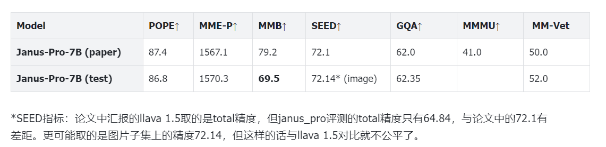
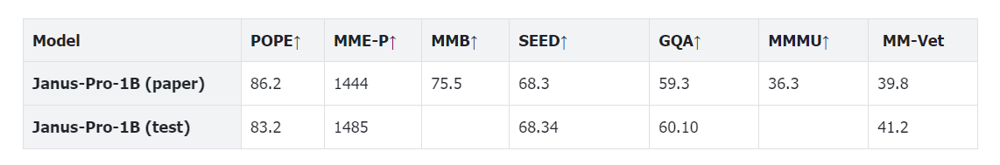
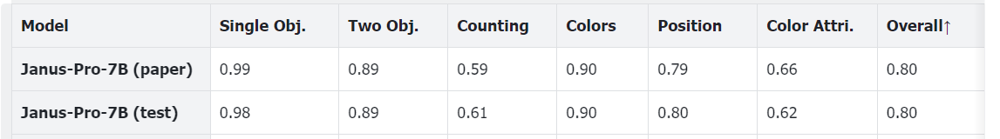
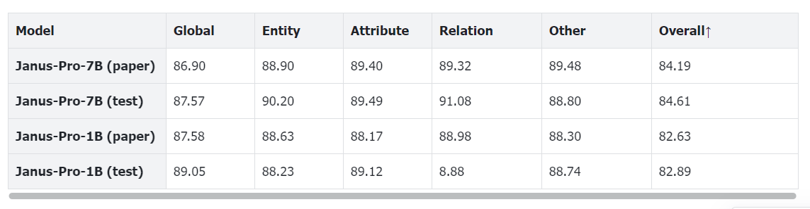

# 评测
运行环境
~~~sh
source /home/node-user/.bashrc
conda activate janus_pro
cd /storage/jp/Janus
~~~
路径
~~~sh
CKPT_PATH="/storage/jp/Janus/Janus-Pro-1B"
NAME="test"
~~~
目前的CKPT_PATH会传入from_pretrained，尚未实现加载checkpoint的方法。
## 多模态理解
共七个指标，POPE，MME-P，SEED，GQA和MM-Vet可本地评测，MMBench和MMMU需上传到平台评测。

> MMMU评测需evalai账号，mmbench复现精度与论文中差异较大。

### MME-P
3 min
~~~sh
CUDA_VISIBLE_DEVICES=0 bash eval/playground/MME/mme.sh
~~~

### POPE
5 min
~~~sh
CUDA_VISIBLE_DEVICES=0,1,2,3,4,5,6,7 bash eval/playground/pope/pope.sh
~~~

### SEED
5 min
~~~sh
CUDA_VISIBLE_DEVICES=0,1,2,3,4,5,6,7 bash eval/playground/seed_bench/seed.sh
~~~

### MM-VET
13 min
~~~sh
CUDA_VISIBLE_DEVICES=0 bash eval/playground/mm-vet/mmvet.sh
~~~
> 评测会消耗GPT4 token

### GQA
3 min
~~~sh
CUDA_VISIBLE_DEVICES=0,1,2,3,4,5,6,7 bash eval/playground/gqa/gqa.sh
~~~

### MMBench
13 min
~~~sh
CUDA_VISIBLE_DEVICES=0 bash eval/playground/mm-vet/mmvet.sh
~~~

### MMMU 
~~~sh
CUDA_VISIBLE_DEVICES=0,1,2,3,4,5,6,7 bash eval/playground/mmmu/mmmu.sh
~~~

## 视觉生成
### GenEval

~~~sh
CUDA_VISIBLE_DEVICES=0,1,2,3,4,5,6,7 bash eval/playground/geneval/geneval.sh
~~~
### DPGBench

~~~sh
CUDA_VISIBLE_DEVICES=0,1,2,3,4,5,6,7 bash eval/playground/dpg_bench/dist_eval.sh
~~~
